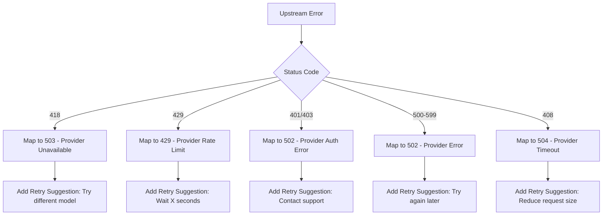

# Plan: Better Error Reporting and Model IDs

## Overview

This plan addresses two key improvements to the CloudGPT API:
1. **Better Error Reporting** - Structured errors with provider context, specific error codes, and retry suggestions
2. **Better Model IDs** - Expanded OpenAI-compatible aliases and standardized naming conventions

---

## Part 1: Better Error Reporting

### Current State

The current error handling in [`app/v1/chat/completions/route.ts`](app/v1/chat/completions/route.ts:554) has basic error mapping:
- Maps 418 to 503 with a generic message
- Returns `upstream_error` code for all provider errors
- No retry suggestions or provider-specific context

### Proposed Architecture

#### 1.1 Create Error Handling Utility Module

Create a new file [`lib/errors.ts`](lib/errors.ts) with:

```typescript
// Error codes enum for type safety
export enum ErrorCode {
  // Client errors
  INVALID_REQUEST = 'invalid_request',
  INVALID_MESSAGES = 'invalid_messages',
  MODEL_NOT_FOUND = 'model_not_found',
  RATE_LIMIT_EXCEEDED = 'rate_limit_exceeded',
  
  // Provider errors
  PROVIDER_UNAVAILABLE = 'provider_unavailable',
  PROVIDER_RATE_LIMIT = 'provider_rate_limit',
  PROVIDER_TIMEOUT = 'provider_timeout',
  PROVIDER_AUTH_ERROR = 'provider_auth_error',
  PROVIDER_OVERLOADED = 'provider_overloaded',
  PROVIDER_MODEL_UNAVAILABLE = 'provider_model_unavailable',
  
  // Server errors
  INTERNAL_ERROR = 'internal_error',
  EMPTY_RESPONSE = 'empty_response',
}

// Structured error response
export interface ApiError {
  message: string;
  type: string;
  code: ErrorCode;
  param?: string | null;
  provider?: string;
  request_id?: string;
  retry_after?: number;
  suggestion?: string;
  original_status?: number;
  details?: string;
}
```

#### 1.2 Provider-Specific Error Mapping



#### 1.3 Error Response Format

```json
{
  "error": {
    "message": "The Liz proxy is temporarily rate limited. Please try again in 30 seconds or use a different model.",
    "type": "provider_error",
    "code": "provider_rate_limit",
    "param": null,
    "provider": "liz",
    "request_id": "req_abc123",
    "retry_after": 30,
    "suggestion": "Try using 'openai' or 'claude' models from Pollinations provider instead.",
    "original_status": 429
  }
}
```

---

## Part 2: Better Model IDs

### Current State

Current aliases in [`app/v1/chat/completions/route.ts`](app/v1/chat/completions/route.ts:371):
```typescript
const modelAliases: Record<string, string> = {
  'gpt-4o': 'openai',
  'gpt-4o-mini': 'openai-fast',
  'gpt-4.5': 'openai-large',
  'gpt-4': 'openai',
  'gpt-3.5-turbo': 'openai-fast',
  'claude-3-5-sonnet': 'claude',
  'claude-3-haiku': 'claude-fast',
  'deepseek-chat': 'deepseek',
  'deepseek-coder': 'qwen-coder',
};
```

### Proposed Model ID System

#### 2.1 Expanded OpenAI-Compatible Aliases

Move aliases to [`lib/providers.ts`](lib/providers.ts) and expand:

```typescript
export const MODEL_ALIASES: Record<string, string> = {
  // OpenAI aliases
  'gpt-4o': 'openai',
  'gpt-4o-mini': 'openai-fast',
  'gpt-4o-2024-05-13': 'openai',
  'gpt-4-turbo': 'openai',
  'gpt-4-turbo-preview': 'openai',
  'gpt-4.5': 'openai-large',
  'gpt-4.5-preview': 'openai-large',
  'gpt-4': 'openai',
  'gpt-3.5-turbo': 'openai-fast',
  'gpt-3.5-turbo-16k': 'openai-fast',
  
  // Claude aliases - map to Pollinations or Liz
  'claude-3-5-sonnet': 'claude',
  'claude-3-5-sonnet-20240620': 'claude',
  'claude-3-sonnet': 'claude',
  'claude-3-haiku': 'claude-fast',
  'claude-3-opus': 'claude-3-opus',  // Liz model
  'claude-3.5-sonnet': 'claude-3.5-sonnet',  // Liz model
  'claude-sonnet-4': 'claude-sonnet-4',  // Liz model
  
  // Gemini aliases
  'gemini-pro': 'gemini',
  'gemini-1.5-pro': 'gemini-large',
  'gemini-1.5-flash': 'gemini-fast',
  'gemini-2.0-flash': 'gemini',
  'gemini-2.5-pro': 'gemini-2.5-pro',  // Liz model
  
  // DeepSeek aliases
  'deepseek-chat': 'deepseek',
  'deepseek-coder': 'qwen-coder',
  'deepseek-v3': 'deepseek-v3',  // Liz model
  'deepseek-r1': 'deepseek-r1',  // Liz model
  
  // Mistral aliases
  'mistral-large': 'mistral',
  'mistral-medium': 'mistral',
  'mistral-small': 'mistralai/mistral-small-3.1-24b-instruct:free',
  
  // Llama aliases
  'llama-3.1-70b': 'meta-llama/llama-3.1-405b-instruct:free',
  'llama-3.1-405b': 'meta-llama/llama-3.1-405b-instruct:free',
  'llama-3.3-70b': 'meta-llama/llama-3.3-70b-instruct:free',
  
  // Grok aliases
  'grok': 'grok',
  'grok-3': 'grok',
  
  // Perplexity aliases
  'perplexity': 'perplexity-fast',
  'perplexity-online': 'perplexity-fast',
};
```

#### 2.2 Standardized Model ID Format

Add support for provider-prefixed model IDs:

```typescript
// Format: provider/model-name
// Examples:
// - pollinations/openai
// - liz/claude-3.5-sonnet
// - openrouter/meta-llama/llama-3.3-70b-instruct:free

function resolveModelId(requestedModel: string): { modelId: string; provider?: string } {
  // Check for provider prefix
  if (requestedModel.includes('/')) {
    const [prefix, ...rest] = requestedModel.split('/');
    const modelPart = rest.join('/');
    
    // Check if prefix is a known provider
    if (['pollinations', 'liz', 'openrouter', 'stablehorde', 'meridian'].includes(prefix)) {
      return { modelId: modelPart, provider: prefix };
    }
  }
  
  // Check aliases
  if (MODEL_ALIASES[requestedModel]) {
    return { modelId: MODEL_ALIASES[requestedModel] };
  }
  
  // Return as-is
  return { modelId: requestedModel };
}
```

#### 2.3 Update /v1/models Endpoint

Enhance [`app/v1/models/route.ts`](app/v1/models/route.ts) to expose aliases:

```typescript
// Add aliases field to model response
{
  "id": "openai",
  "object": "model",
  "created": 1699000000,
  "owned_by": "pollinations",
  "aliases": ["gpt-4o", "gpt-4", "gpt-4-turbo"],
  "description": "OpenAI GPT-4o model"
}
```

---

## Implementation Files

| File | Changes |
|------|---------|
| [`lib/errors.ts`](lib/errors.ts) | NEW - Error handling utilities |
| [`lib/providers.ts`](lib/providers.ts) | Add MODEL_ALIASES and resolveModelId |
| [`app/v1/chat/completions/route.ts`](app/v1/chat/completions/route.ts) | Use new error handling, import aliases |
| [`app/v1/models/route.ts`](app/v1/models/route.ts) | Expose aliases in response |

---

## Error Code Reference

| Code | HTTP Status | Description | Retry Suggestion |
|------|-------------|-------------|------------------|
| `invalid_request` | 400 | Malformed request | Fix request format |
| `invalid_messages` | 400 | Invalid messages array | Check message structure |
| `model_not_found` | 400 | Unknown model ID | Use /v1/models to list available models |
| `rate_limit_exceeded` | 429 | Client rate limit | Wait for reset time |
| `provider_unavailable` | 503 | Provider is down | Try different model/provider |
| `provider_rate_limit` | 429 | Provider rate limited | Wait or use different provider |
| `provider_timeout` | 504 | Provider timed out | Reduce request size or try later |
| `provider_auth_error` | 502 | Provider auth failed | Contact support |
| `provider_overloaded` | 503 | Provider overloaded | Try different model |
| `provider_model_unavailable` | 503 | Specific model unavailable | Try different model |
| `internal_error` | 500 | Server error | Try again later |
| `empty_response` | 502 | Provider returned empty | Try again |

---

## Model Alias Categories

### Tier 1: OpenAI Compatible - Most Common
These are the most frequently used aliases for OpenAI SDK compatibility:
- `gpt-4o`, `gpt-4o-mini`, `gpt-4`, `gpt-3.5-turbo`

### Tier 2: Claude Compatible
For Anthropic SDK users:
- `claude-3-5-sonnet`, `claude-3-opus`, `claude-3-haiku`

### Tier 3: Other Providers
For users of other AI providers:
- `gemini-pro`, `gemini-1.5-pro`, `mistral-large`, `llama-3.1-70b`

### Tier 4: Provider-Prefixed
For explicit provider selection:
- `pollinations/openai`, `liz/claude-3.5-sonnet`, `openrouter/meta-llama/llama-3.3-70b-instruct:free`

---

## Testing Checklist

- [ ] Test 418 error returns proper 503 with retry suggestion
- [ ] Test 429 error includes retry_after header
- [ ] Test all OpenAI aliases resolve correctly
- [ ] Test provider-prefixed model IDs work
- [ ] Test /v1/models returns aliases
- [ ] Test error responses include provider name
- [ ] Test request_id is included in all error responses
